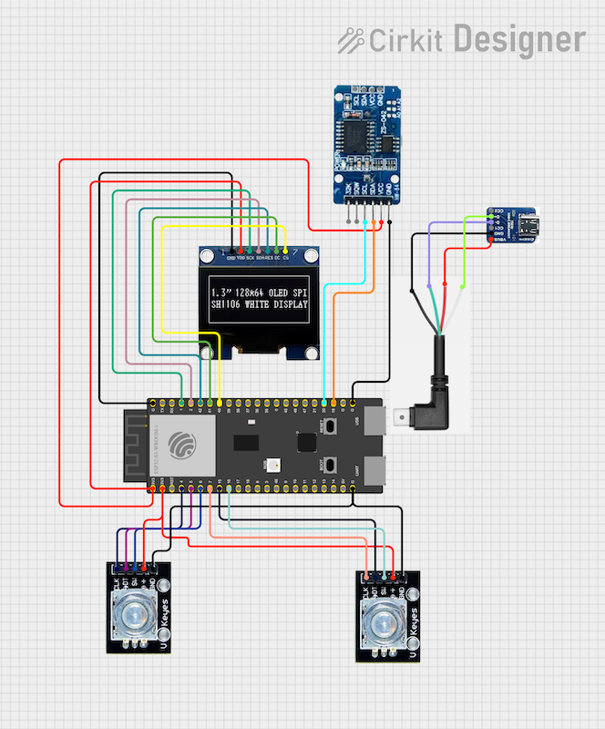
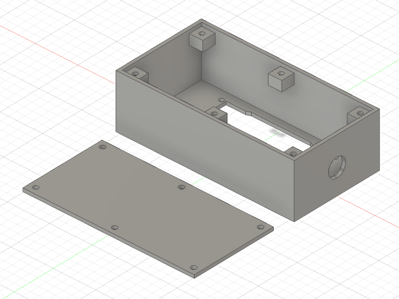

# microarcade

A tiny gaming console with 1-bit graphics and rotary encoders. It is built
from cheap components and the firmware was written completely from scratch (no
3rd party libraries).

## Why rotary encoders?

They're my favorite input devices for small builds. They take up very little
space yet allow you to do just about any type of input. I have long wondered
whether it would be possible to build a small console that uses two
rotary encoders for its input, supporting both single- and multi-user play.
(Verdict: you can!)

## Why no 3rd party libraries?

First off, we are not talking about bare metal. `microarcade` is based on
ESP32 and so is built using `esp-idf`, and runs on `FreeRTOS`. I'm only
talking about drivers to talk to the connected peripherals...

The two main types of peripherals the MCU interfaces with is the OLED display
and the rotary encoders. (There is also a separate clock module but that is
very simple to interface with using i2c).

Rotary encoders are quite simple devices, but it is a surprisingly challenging
(and interesting) problem to build a driver for them that stands up to the
rigors of gaming. Most drivers out there are actually not that accurate in
terms of counting and will lose steps if you turn them fast as well as display
other problems due to bounce. For more information on this, check out
[esp_rotary]() which is my rotary encoder driver for esp-idf.

In the case of the display, I looked into several of the existing popular
graphics display libraries (eg. `Adafruit-GFX`, `U8g2`) but was surprised by
how inefficiently implemented they are and yet how complex their APIs are
(these two problems go hand in hand). If you instrument their code to log the
commands they send to the display, you will be able to observe this: for
example, data transfers are unnecessarily broken up into several transactions
and many more commands are sent that would actually be necessary. All in
all, many more bytes are sent to the display than necessary and that many
times per second so it all would add up and reduce our per-frame CPU budget
during gameplay. These libraries appear to be a bit cobbled together and copy+pastey and therefore not appropriate for what I wanted here (small & fast
code).

## Parts list

* 1x [ESP-32-S3](https://a.co/d/aNbB3Xg)
* 1x [OLED](https://a.co/d/eaWpX4F) -- use the SPI version
* 2x [Rotary encoder](https://a.co/d/dhtsNsp)
* 1x [RTC](https://a.co/d/ggVVWnh)
* 1x [Panel-mount USB C socket](https://a.co/d/aPcbE0N) - use "Screw Nut Mount Type"
* 1x [4-pin right-angle USB C cable](https://a.co/d/cTP49Ir)

## Wiring diagram

Wiring is quite simple -- everything is hooked up to
gpios / 3.3V / common as appropriate.

There is no battery in the current design, just a USB-C socket. I always have a
power source around so I didn't find it necessary to add a dedicated battery,
and this allows the encloser to be extra small and lightweight.  Additionally
having the USB socket on the enclosure go directy into the esp32's USB input
allows me to easily flash new code without needing to open the enclosure or
adding additional sockets. That said, a rechargeable battery could be added
quite easily.

The reason there's a separate clock module is that I wanted `microarcade` to be
able to function as a desktop clock so needed something that can keep time when
the device is turned off.

## Enclosure

The enclosure is 3D printed to fit the specified parts exactly.
Fusion 360 and BambuLab and STL files are provided in the enclosure folder.

Tips:
* I print my enclosures using plain matte PLA filament
* It's a good idea to enable "support" in the slicer for the screw tabs
* The display should be attached to the enclosure using M2.5 screws and nuts.
* The screw holes for the lid are sized for M3 screws. They will tap their
own thread as you screw them in for the first time. Do not overtighten.

## Notes on the firmware

## The local context

microarcade is a collection of menus and modules. Menus will call modules
(games) and modules themselves will display their own menus at times.
Whenever such a switch occurs, the callee will very likely change things like
display mode, display refresh rate (fps) and rotary configuration.

It such cases it is up to the callee to restore all settings to the way it
found them when it was called. The local_context struct and associated
functions are provided to help with easily backing up / restoring context.
