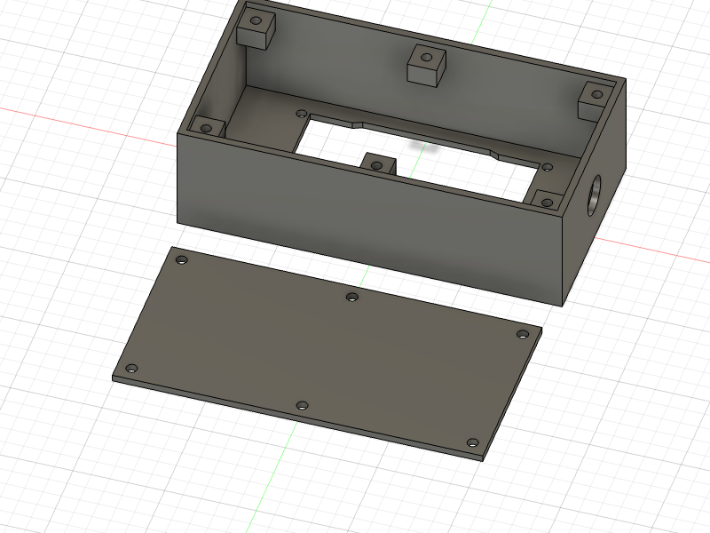

## Files for 3D printing the enclosure

Tips:
- Print using PLA filament (or better).
- It's a good idea to enable "support" in the slicer for the screw tabs.
- The screw holes are sized for M3 screws.
